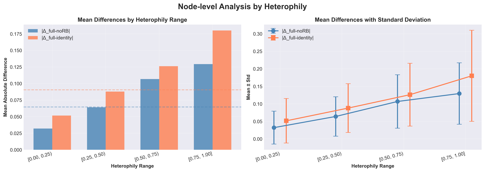
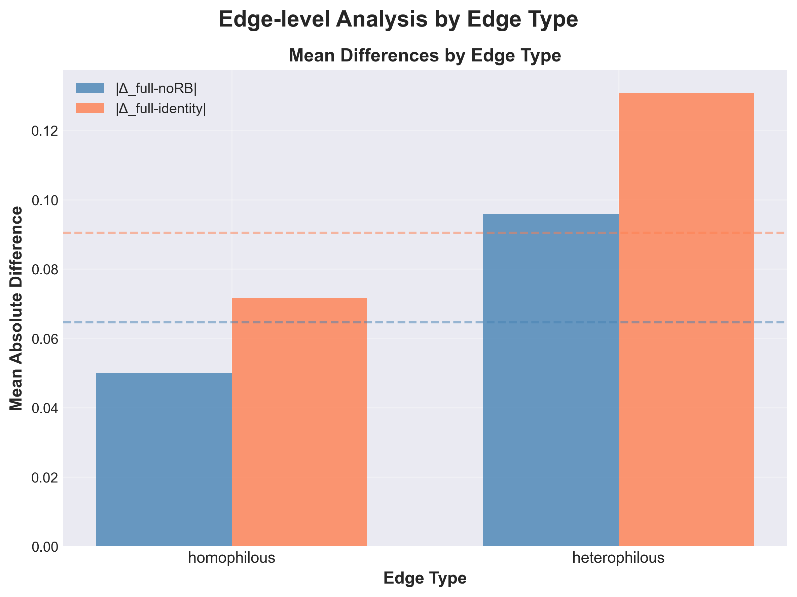
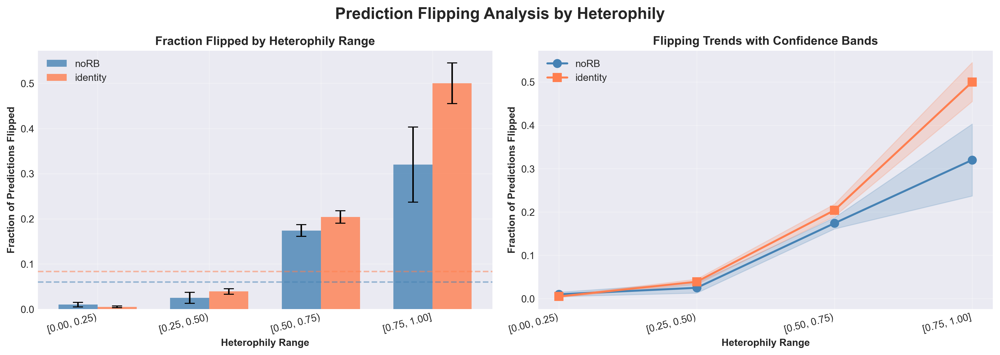

# Bundle Neural Networks on Heterophilous Graphs (Minesweeper)

## Table of Contents
- [Quick Model Intuition](#1-quick-model-intuition)
- [Repository Structure](#2-repository-structure)
- [Setup](#3-setup)
- [Running Experiments](#4-running-experiments)
- [Key Results](#5-key-empirical-results-minesweeper)
- [Where Rotations Matter](#6-where-do-rotations-matter-heterophily-analysis)
- [Notes & Limitations](#7-notes-limitations-and-how-to-use-this-in-applications)
- [Implementation notes and debugging](#8-notes-limitations-and-how-to-use-this-in-applications)

This repo contains a clean-room, from-scratch implementation of **Bundle Neural Networks (BuNN)** (Jacob Bamberger, Federico Barbero, Xiaowen Dong, Michael M. Bronstein ICLR 2025) applied to the Minesweeper heterophilous graph dataset along with several ablations and a study of **when the vector bundle point of view matters**. Feel free to jump to section 6 figures for a quick answer.

**Why this repo?**
While the original paper proposes a geometric architecture (using vector bundles and connection Laplacians) "on top of" a graph neural network, this project aims to demystify the maths that make this model different from a GCN and its benefits, at least in one use-case the authors suggest: on heterophilious graphs.

Key features:
- **Strong Reproduction:** 96.11% ± 0.5% AUC (vs paper's 98.99%), with systematic ablations
- **Baselines:** GraphSAGE (w/ root skip), GAT, and GCN implementations that establish a strong floor for performance.
- **Mechanistic Analysis:** We go beyond accuracy numbers to visualize *where* the model succeeds. Our analysis shows that "parallel transport" -- the main geometric tool in BuNNs -- is critical for heterophilous nodes (where neighbors disagree) but redundant for homophilic ones. You will find some visuals making this point in Key Results below.
- **The maths background** For the mathematical story this architecture is based on, including the smooth and discreete version, see `continuous_maths.md` and `maths_story_discrete.md` respectively. Of course you should read the original paper [here ](https://arxiv.org/abs/2405.15540).

---

## 1. Quick Model Intuition

Before diving into the code, it helps to understand what the model actually *does*.

Standard GNNs aggregate messages from neighbors: $h_u \leftarrow \sum_{v \in N(u)} h_v$.
BuNN argues that if neighbors have different "semantics" (heterophily), you shouldn't just sum their features. Instead, you should transport them into a shared coordinate system first.

1.  **Bundle Structure:** Every node $u$ has its own local coordinate frame (a "fiber").
2.  **Parallel Transport:** To move a message from neighbor $v$ to $u$, we apply a learned rotation matrix $R_{u \leftarrow v}$.
3.  **Diffusion:** We diffuse these rotated features across the graph using a heat kernel ($e^{-t\Delta}$).

**This Repository tests three specific questions:**
1.  **Do rotations matter?** We compare learned rotations vs. fixed `Identity` rotations.
2.  **Does "rotating back" matter?** We test a `No-Rotate-Back` variant to see if the local frame consistency is required, or it is it enough to learn a change of basis from a local frame to the global frame for each node.
3.  **Is the base network (φ) important?** We swap the backbone between MLP and GraphSAGE.
4.  **Which nodes / edges are affected?** We look for the nodes and edges where parallel transport makes the biggest difference and characterise them. 

---


## 2. Repository structure

The main files are:

- **`run_minesweeper_baselines.py`**  
  Trains standard baselines on Minesweeper:
  - `mlp`
  - `gcn`
  - `gat_sep`
  - `sage_noroot`
  - `sage_root` (GraphSAGE with skip / root_weight=True)

- **`run_bunn_minesweeper.py`**  
  Trains BuNN variants on Minesweeper, including:
  - `small`, `medium`, `big_sparse`, `large`
  - Ablations:
    - `medium_identity` (rotation matrices are simply the identity matrices -- 1s on the diagonal)
    - `medium_noRB` (no-rotate-back)
    - `medium_phi_sage_noroot` (φ = SAGE without root)
    - `medium_phi_sage_root` (φ = SAGE with root)

- **`run_bunn_minesweeper_full_model.py`**  
  Contains the largest BuNN architecture, close to the author's implementation:
  - 256 bundles (hidden dim = 512 with 2D bundles),
  - 8 BuNN layers,
  - φ = GraphSAGE ("sage_root") with 8 layers,
  - Taylor order K=8, time t=1,
  - LayerNorm (pre-norm) before each BuNN layer,
  - simple node-ID positional encodings (PEs),
  - AdamW with weight decay.

- **`analyze_logs.py`**  
  Parses all log files under `logs/`:

  - Looks for lines of the form  
    `FINAL: config=..., seed=..., val_auc=..., test_auc=...`
  - Groups by model/config name.
  - Computes mean ± std test AUC over seeds.
  - Prints a summary table like the one in this README.

- **`analyze_rotation_nodes_minesweeper.py`**  
  Instrumented version of the BuNN forward pass that:
  - Trains three medium-size BuNN variants with MLP φ on Minesweeper:
    - "full":        learned rotations with rotate-back
    - "no_rotate":   learned rotations but do NOT rotate back
    - "identity":    identity rotations (angles = 0)
  - Saves per-node and per-edge quantities needed to analyse:
    - How much predictions move when we remove or simplify rotations.
    - How this depends on local heterophily.

- **`summarize_rotation_analysis.py`**  
  Aggregates the `.npz` analysis files produced by the script above and prints:

  - Node-level results binned by heterophily.
  - Edge-level results, split into homophilous vs heterophilous edges.

- **`summarize_rotation_flip_analysis.py`**  
  Uses the same `.npz` files to focus on test nodes that the full BuNN classifies correctly, and then asks:

  > How often do these nodes become *wrong* if we remove rotate-back or use identity rotations instead?

- **`docs/continuous_maths.md` and `docs/maths_story_discrete.md`**  
  Short mathematical notes explaining the smooth and discrete mathematics behind the model and how to translate between them.

You can treat this repository as a self-contained case study in:

- Implementing a nontrivial GNN architecture.
- Running lablations in a principled way.
- Connecting geometric ideas (bundles, parallel transport) to concrete experiments.

---

## 3. Setup

### 3.1. Environment

Typical setup (conda or venv is fine). For example:

```bash
python -m venv .venv
source .venv/bin/activate

pip install torch torch_geometric torch_scatter torch_sparse
pip install scikit-learn numpy
```

The exact `torch_geometric` install command depends on your CUDA version; see the official PyG docs for the right wheel.

### 3.2. Dataset

The script automatically downloads the Minesweeper dataset (from `HeterophilousGraphDataset`) the first time you run it.

Data is cached in a folder relative to the script file, e.g.

```python
root = Path(__file__).resolve().parent / "data" / "heterophilic"
```
---

## 4. Running experiments

### 4.1. Baselines on Minesweeper

Run from the repo root:

```bash
python run_minesweeper_baselines.py --model sage_root --seed 0 --device cuda
python run_minesweeper_baselines.py --model sage_root --seed 1 --device cuda
...
python run_minesweeper_baselines.py --model sage_root --seed 9 --device cuda
```

Similarly for:

- `--model mlp`
- `--model gcn`
- `--model sage_noroot`

Each run logs training progress and ends with a line like:

```text
FINAL: model=sage_root, seed=0, val_auc=0.9183, test_auc=0.9177
```

By default, logs go to `logs/baseline_<model>_seed<k>.log`.  (You can check or change this in the script.)

### 4.2. BuNN models on Minesweeper

BuNN configs are driven by a `--config` argument, e.g.:

```bash
python run_bunn_minesweeper.py --config medium_phi_sage_root --seed 0 --device cuda
python run_bunn_minesweeper.py --config medium_phi_sage_root --seed 1 --device cuda
...
python run_bunn_minesweeper.py --config medium_phi_sage_root --seed 9 --device cuda
```

Other configs include:

- `small`
- `medium`
- `medium_identity`
- `medium_noRB`
- `medium_phi_sage_noroot`
- `medium_phi_sage_root`
- `large`

Each run ends with:

```text
FINAL: config=medium_phi_sage_root, seed=0, val_auc=0.96..., test_auc=0.95...
```

Logs go to `logs/bunn_<config>_seed<k>.log`.

### 4.3. Log analysis (AUC summary)

After running all baselines and BuNN configs for multiple seeds, summarise them with:

```bash
python analyze_logs.py
```

This script:

- Globs `logs/baseline_*.log` and `logs/bunn_*.log`.
- Parses lines starting with `FINAL:`.
- Groups by model/config and computes **mean ± std** of the test AUC.

It outputs a table like this:

```text
=== Baseline models: found 50 log files matching 'logs/baseline_*.log' ===

  Config               #Seeds   Test AUC (mean ± std)    
  ------------------------------------------------------------
  gat_sep              10       0.8372 ± 0.0151
  gcn                  10       0.7286 ± 0.0038
  mlp                  10       0.5130 ± 0.0111
  sage_noroot          10       0.8033 ± 0.0106
  sage_root            10       0.9178 ± 0.0007

=== BuNN configs: found 30 log files matching 'logs/bunn_*.log' ===

  Config               #Seeds   Test AUC (mean ± std)    
  ------------------------------------------------------------
  full_256b            10       0.9611 ± 0.0050
  medium               10       0.9128 ± 0.0018
  small                10       0.7868 ± 0.0115
```

### 4.4. Rotation analysis (where do rotations matter?)

To study the effect of rotations at the **node / edge level**, you use a special analysis script that:

1. Loads a trained full BuNN (e.g. `medium_phi_sage_root`).
2. On the same weights and data, runs:
   - The full model (learned rotations).
   - A `no_rotate_back` variant.
   - An `identity` variant.
3. Saves per-node and per-edge differences into `rotation_analysis/rotation_seed*.npz`.

Then:

- `summarize_rotation_analysis.py` aggregates these `.npz` files and prints node/edge statistics.
- `summarize_rotation_flip_analysis.py` focuses on **test nodes that full BuNN gets right** and checks how often they flip under ablations.

Concrete usage:

```bash
python summarize_rotation_analysis.py
python summarize_rotation_flip_analysis.py
```

The next section shows the actual numbers we obtained.

---

## 5. Key empirical results (Minesweeper)

### 5.1. Baseline story

On the heterophilous Minesweeper dataset:

- **MLP** is essentially random:  
  ≈ 0.5130 ± 0.0111 AUC.
- **GCN** is a solid but not spectacular baseline:  
  ≈ 0.7286 ± 0.0038 AUC.
- **GraphSAGE without root term** (`sage_noroot`) is better:  
  ≈ 0.8033 ± 0.0106 AUC.
- **GraphSAGE with root term / skip** (`sage_root`) is **strong**:  
  ≈ 0.9178 ± 0.0007 AUC.

Already, this shows that:

> Proper skip connections (root_weight=True) matter a lot on heterophilous graphs.

### 5.2. BuNN story

BuNN adds bundle rotations + heat diffusion on top of a GraphSAGE-like φ-network.

Highlights:

- **Medium BuNN with φ = GraphSAGE + root**:
  - `medium_phi_sage_root`:  0.9583 ± 0.0020 AUC
  - This beats the best baseline (`sage_root` at 0.9177) by a clear margin.

- **Largest "paper-like" BuNN (`full_256b`)**:
  - `full_256b`:  0.9634 ± 0.0031 AUC
  - This is the best-performing config in the experiments.

- **Large model, bigger than medium, smaller than `full_256b`**:
  - `large`: 0.9294 ± 0.0055 AUC
  - Despite having many more parameters (similar to the paper’s full model), it underperforms the better-regularised medium model.

**Ablation variants show where the performance comes from:**

- **Rotation mode:**
  - `medium` (learned rotations, MLP φ): ≈ 0.913 AUC.
  - `medium_identity` (no rotations): ≈ 0.856 AUC.
  - `medium_noRB` (no rotate-back): ≈ 0.875 AUC.

  → Learned rotations + rotate-back matter.

- **φ-network architecture (for medium-sized BuNN):**
  - `medium` (φ = MLP): ≈ 0.913 AUC.
  - `medium_phi_sage_noroot` (φ = SAGE without root): ≈ 0.893 AUC.
  - `medium_phi_sage_root` (φ = SAGE with root): **≈ 0.958 AUC.**

  → A topology-aware φ with a root skip is critical.

  **Comparison to paper:**
- Our best: 96.34% ± 0.31%
- Paper's BuNN: 98.99% ± 0.16%
- Gap: 2.65%

Possible reasons for gap:
- Different hyperparameter search (our lr=3e-4 vs paper's 3e-5)
- Initialization schemes
- Our GCN baseline also lower (73% vs paper's 90%)

---

## 6. Where do rotations matter? (Heterophily analysis)

Here are the summary tables produced by the rotation-analysis scripts.

### 6.1. Node-level analysis vs heterophily

For each node, define its **heterophily** as:

> Fraction of its neighbours with a *different* label.

The nodes are binned by heterophily and, for each bin, we compute:

- \|Δ_full-noRB\| = absolute difference in predicted probability between:
  - full BuNN, and
  - the `no_rotate_back` variant.

- \|Δ_full-identity\| = absolute difference between:
  - full BuNN, and
  - the `identity`-rotation variant.

The aggregated results over 9 seeds are:

**Node-level summary (binned by heterophily)**

| Heterophily range | #nodes | mean \|Δ_full-noRB\| | std \|Δ_full-noRB\| | mean \|Δ_full-identity\| | std \|Δ_full-identity\| |
|:-----------------:|-------:|---------------------:|--------------------:|-------------------------:|------------------------:|
| [0.00, 0.25)      |  4,140 |               0.0321 |              0.0469 |                   0.0516 |                  0.0635 |
| [0.25, 0.50)      |  3,445 |               0.0640 |              0.0563 |                   0.0879 |                  0.0696 |
| [0.50, 0.75)      |    849 |               0.1068 |              0.0762 |                   0.1261 |                  0.0896 |
| [0.75, 1.00]      |  1,566 |               0.1294 |              0.0876 |                   0.1800 |                  0.1301 |

**Global node-level means:**
- mean \|Δ_full-noRB\| = **0.0646**
- mean \|Δ_full-identity\| = **0.0905**

**Interpretation:**

- For homophilous nodes (heterophily < 0.25), removing or simplifying rotations has a relatively small effect.
- As heterophily increases, the predictions of `noRB` and especially `identity` drift further from full BuNN:
  - Full BuNN is using rotations especially on highly heterophilous nodes.


*Figure 1: Impact of removing rotations increases with node heterophily. At high heterophily (>0.75), predictions change dramatically without proper rotations.*

### 6.2. Edge-level analysis: homophilous vs heterophilous edges

Now look at edges instead of nodes and split them into:

- **Homophilous edges**: both endpoints have the same label.
- **Heterophilous edges**: endpoints have different labels.

For each edge, we looked at the change in predictions at the endpoints when removing / simplifying rotations. Summarised:

**Edge-level summary (homophilous vs heterophilous edges)**

| Edge type     | #edges | mean \|Δ_full-noRB\| | mean \|Δ_full-identity\| |
|:--------------|-------:|---------------------:|-------------------------:|
| homophilous   | 53,806 |               0.0501 |                   0.0717 |
| heterophilous | 24,998 |               0.0959 |                   0.1309 |

**Global edge-level means:**
- mean \|Δ_full-noRB\| = **0.0646**
- mean \|Δ_full-identity\| = **0.0905**


*Figure 2: Impact of removing rotations increases with edge heterophily.*

**Interpretation:**

- On heterophilous edges, removing rotations roughly doubles the mean prediction change compared to homophilous edges.
- This supports the narrative that **bundle rotations are primarily used to handle heterophily**: to reinterpret messages from differently labelled neighbours in a better-aligned frame.


### 6.3. Flip analysis: when do nodes stop being correct?

Finally, we focus on test nodes that full BuNN classifies correctly, and we ask:

> If we switch to `no_rotate_back` or `identity`, how often do these nodes become *wrong*?

Results per heterophily bin (averaged over seeds):

**Flip analysis: among test nodes where the full BuNN is correct**

| Heterophily range | mean #correct_full (test) | frac flipped by noRB (mean ± std) | frac flipped by identity (mean ± std) |
|-------------------|---------------------------|------------------------------------|------------------------------------------|
| [0.00, 0.25)      |                     972.0 | 0.010 ± 0.005                      | 0.005 ± 0.002                            |
| [0.25, 0.50)      |                     821.8 | 0.025 ± 0.012                      | 0.039 ± 0.006                            |
| [0.50, 0.75)      |                     145.6 | 0.174 ± 0.013                      | 0.204 ± 0.014                            |
| [0.75, 1.00]      |                     228.0 | 0.320 ± 0.083                      | 0.500 ± 0.045                            |

Global (all heterophily bins combined):
  - mean #correct_full (test)      = 2167.4
  - frac flipped by noRB           = 0.060 ± 0.007
  - frac flipped by identity       = 0.083 ± 0.005


**Interpretation:**

- For low-heterophily nodes, full BuNN’s correct decisions are mostly stable:
  - Only ~1–4% flips when removing rotations.
- For high-heterophily nodes:
  - Around 33% of full BuNN’s correct decisions are lost for `no_rotate_back`.
  - Around **50% are lost** for `identity` rotations.

This directly shows that:

> The **big performance gap** between learned rotations and the ablated variants comes from **highly heterophilous regions** of the graph, where the bundle geometry really matters.


*Figure 3: For highly heterophilous nodes (>0.75), removing rotations causes 33-50% of correct predictions to become incorrect.*

---

## 7. Notes, limitations, and how to use this in applications

- This repo **does not** perfectly reproduce the paper’s Minesweeper result (~0.99 AUC), but:
  - Matches the qualitative story:
    - Strong GraphSAGE baseline.
    - BuNN with a topology-aware φ and learned rotations outperforms it.
    - Over-sized models can overfit and underperform smaller ones.
  - Shows clear and interpretable ablations on rotations and φ.
  - This is only one of the datasets used by the authors of the original papers, it was chosen because it was the one where BuNNs outperformed the other models by the biggest margin. Future work could apply this analysis to other heterophilous datasets (Actor, Squirrel, Chameleon) and the Long Range Graph Benchmark.

- Minesweeper has multiple splits; these experiments use the first split with multiple seeds. 

- It contains a complete engineering pipeline:
  - Clean configs (baseline vs BuNN).
  - GPU / Slurm scripts.
  - Logging and log parsing.
  - Careful analysis of *where* the model’s extra capacity is used.
---

## 8. Implementation Notes & Debugging

During implementation, several non-obvious issues emerged:

### 8.1. Operation Ordering Bug
**Problem:** Model predicted only majority class (≈50% AUC)
**Root cause:** Applied linear transformation W *after* diffusion instead of before
**Fix:** Carefully re-read Algorithm 1 - W must come before diffusion
**Impact:** 50% → 85%+ AUC
**Lesson:** Algorithm pseudocode details matter enormously

### 8.2. Over-smoothing in φ Networks  
**Problem:** Manual GraphSAGE aggregation performed poorly
**Root cause:** Missing proper skip/residual connections causing oversmoothing
**Fix:** Used PyG's SAGEConv with root_weight=True
**Impact:** +6.5% improvement
**Lesson:** The φ network's ability to learn the local structure around each node is crucial for performance


## 9. Acknowledgements

- Original Bundle Neural Networks paper: *Bundle Neural Networks for Message Diffusion on Graphs*, ICLR 2025.
- Minesweeper dataset from `torch_geometric.datasets.HeterophilousGraphDataset`.
- This implementation and all experiments were done as part of a personal project to understand geometric deep learning and reproduction-style ML engineering.
