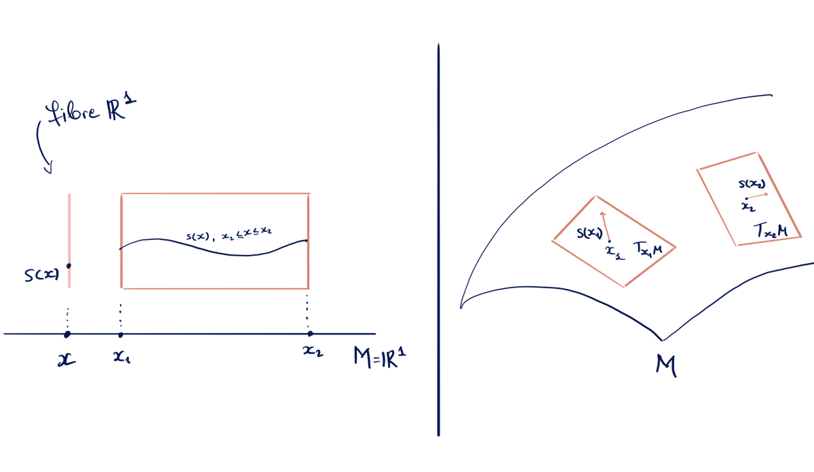
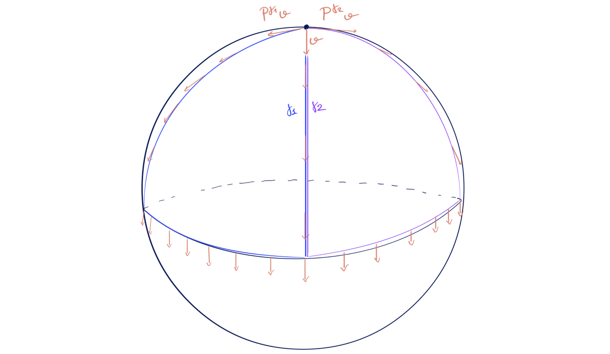
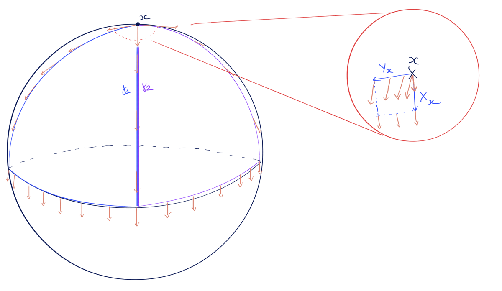
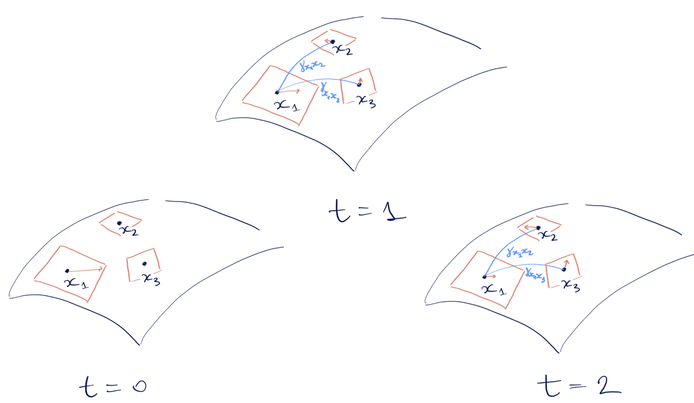

## 5. The Continuous Story: Vector Bundles, Connections, and Diffusion

This section tells the full differential-geometric story that the discrete BuNN architecture is approximating. It's intended for readers who want to see how the "bundle Laplacian" and "flat connection" language connects to classical notions in Riemannian geometry.

The narrative arc is:

1. **Vector bundles and sections** — the "fibre at each point" picture.
2. **Connections and parallel transport** — how to compare vectors at different points.
3. **The connection Laplacian and heat equation** — diffusing sections of a bundle.
4. **Flatness, holonomy, and global frames** — when parallel transport is path-independent.
5. **From continuous to discrete** — how the BuNN construction discretises each ingredient.

---

### 5.1 Vector bundles and sections

Let $M$ be a smooth manifold (think: a surface, or more generally a space that locally looks like $\mathbb{R}^n$).

A **vector bundle** $\pi: E \to M$ of rank $d$ assigns to each point $x \in M$ a $d$-dimensional vector space $E_x$, called the **fibre** over $x$. The total space $E$ is the union of all these fibres, glued together smoothly.

> **Example 1: The trivial bundle.** $E = M \times \mathbb{R}^d$. Every fibre is just a copy of $\mathbb{R}^d$, and there's an obvious way to identify them all.

> **Example 2: The tangent bundle.** $E = TM$, where the fibre $T_x M$ is the tangent space at $x$. On a curved surface, tangent planes at different points are genuinely different vector spaces.

A **section** of $E$ is a smooth map $s: M \to E$ such that $s(x) \in E_x$ for all $x$. In other words, it's a smooth choice of a vector in each fibre.

**Figure 4:** On the left we have Example 1 with $M=\mathbb{R}^1$ and a trivial bundle with fibers $\mathbb{R}^1$, i.e. $d=1$. A section for each point $x$ is just a real number $s(x)$, which gives a curve if we consider all $x$ between $x_1$ and $x_2$. On the right we have the tangent bundle of a surface $M$, i.e. to each point $x$ we associate a tangent plane $T_{x}M$ over it, and a section at a point $x$ is a 2-dimensional vector $s(x)$ tangent to the surface at that point.

In a local region $U \subset M$, we can pick a **local frame**: a collection of sections $e_1, \ldots, e_d$ that form a basis of each fibre $E_x$ for $x \in U$. Any section can then be written as

$$
s = \sum_{a=1}^{d} s^a e_a,
$$

where $s^a: U \to \mathbb{R}$ are smooth functions (the components of $s$ in this frame).

---

### 5.2 Connections: how to differentiate sections

> **Key intuition:** The connection tells you how much a section "rotates" as you move across $M$. The $\omega^a{}_b$ encode the infinitesimal rotation in each direction. Look again at the right of Figure 4 above, the vector $s(x_1)$ is transported to $s(x_2)$ as well as rotated.

On a trivial bundle $M \times \mathbb{R}^d$, differentiating a section is straightforward: just differentiate each component. But on a general vector bundle, there's no canonical way to compare vectors in different fibres. A **connection** provides this structure. Formally it is defined as follows.

A **connection** (or **covariant derivative**) on $E$ is a map

$$
\nabla: \Gamma(E) \to \Gamma(T^*M \otimes E)
$$

satisfying:

- **$\mathbb{R}$-linearity** in the section argument.
- **Leibniz rule**: $\nabla(fs) = df \otimes s + f \nabla s$ for any smooth function $f$.

Given a tangent vector $X \in T_x M$, we can contract to get the covariant derivative in direction $X$:

$$
\nabla_X s := (\nabla s)(X) \in E_x.
$$

Local expression: In a local frame $\{e_a\}$, the connection is determined by connection 1-forms $\omega^a{}_b$ such that

$$
\nabla e_b = \sum_a \omega^a{}_b \otimes e_a.
$$

For a general section $s = s^b e_b$, we have

$$
(\nabla s)^a = ds^a + \sum_b \omega^a{}_b s^b.
$$

---

### 5.3 Parallel transport

Let $\gamma: [0,1] \to M$ be a smooth curve from $x = \gamma(0)$ to $y = \gamma(1)$.

A section $s(t)$ along $\gamma$ (meaning $s(t) \in E_{\gamma(t)}$) is **parallel** if

$$
\nabla_{\dot\gamma(t)} s(t) = 0 \quad \text{for all } t.
$$

This is a first-order linear ODE. Given any initial vector $v \in E_x$, there is a unique parallel section with $s(0) = v$, and we define **parallel transport** as

$$
P_{y \leftarrow x}^\gamma: E_x \to E_y, \qquad P_{y \leftarrow x}^\gamma(v) = s(1).
$$

> **Key point:** Parallel transport gives a linear isomorphism between fibres, but in general it **depends on the path** $\gamma$.

**Figure 5:** A vector $v$ at $x$, and two different paths $\gamma_1$ and $\gamma_2$ to $y$. The parallel-transported vectors $P^{\gamma_1} v$ and $P^{\gamma_2} v$ differ — this difference is measured by **curvature**.

---

### 5.4 Curvature and holonomy

The **curvature** of a connection is the $\mathrm{End}(E)$-valued 2-form

$$
R(X, Y) s := \nabla_X \nabla_Y s - \nabla_Y \nabla_X s - \nabla_{[X,Y]} s.
$$

It measures the failure of covariant derivatives to commute. Equivalently, for a small parallelogram spanned by directions $X, Y$ with area $\epsilon^2$, the parallel transport around the loop is

$$
P_{\text{loop}} = I + \epsilon^2 R(X, Y) + O(\epsilon^3).
$$

So curvature is the **infinitesimal holonomy**.

**Holonomy** is the global version (Figure 5): for a loop $\gamma$ based at $x$, the parallel transport around $\gamma$ defines a linear map

$$
\mathrm{Hol}_\gamma: E_x \to E_x.
$$

The collection of all such maps (for all loops based at $x$) forms the **holonomy group** of the connection.

**Figure 6:** We zoom in to a small neighbourhood of $x$ on our sphere from before. A small loop (a paralelogram spanned by vectors $X_x$ and $Y_x$) on a curved surface. A vector parallel-transported around the loop returns slightly rotated — this rotation angle is the infinitesimal holonomy measured by $R(X,Y)$ at $x$.

---

### 5.5 Flat connections and global frames

A connection is **flat** if its curvature vanishes: $R \equiv 0$.

For flat connections:

- **Locally:** parallel transport is path-independent (on simply connected regions).
- **Globally:** parallel transport depends only on the **homotopy class** of the path.

On a simply connected manifold (manifold with no 'holes', like a sphere, for a counterexample think of a torus), a flat connection admits a **global parallel frame** — sections $e_1, \ldots, e_d$ with $\nabla e_a = 0$ everywhere. In this frame, $\nabla s = ds$, i.e. the connection just becomes ordinary differentiation. Note that we are talking about the bundle here, not the underlying manifold.

On a non-simply connected manifold (like a circle or a torus), a flat connection can still have nontrivial holonomy around non-contractible loops.

> **Example: Flat connection on $S^1$.** Consider the trivial complex line bundle $E = S^1 \times \mathbb{C}$ with connection $\nabla(fe) = (df + i\alpha f \, d\phi) \otimes e$, where $\alpha \in \mathbb{R}$ is constant. The curvature is $d(i\alpha \, d\phi) = 0$, so the connection is flat. But parallel transport around the circle gives holonomy $e^{-2\pi i \alpha}$. If $\alpha \notin \mathbb{Z}$, this is nontrivial.

---

### 5.6 The connection Laplacian

> **Physical picture:** Heat diffuses across $M$, but now it's "vector-valued heat" — at each point we have a vector, and they spread out while being rotated by the connection.

**Figure 7:** A manifold with a 2 dimensional bundle, represented by a plane at 3 points. We start with a large vector at $x_1$ and zero vectors at the other two points. As time evolves, the vectors diffuse/spread, in this case just the one non-zero one we have, but they also rotate according to the connection as information flows from neighbours.

On a Riemannian manifold with a metric $g$, we can define the **connection Laplacian** on sections of $E$:

$$
\Delta^\nabla s = \mathrm{tr}_g(\nabla^2 s) = -\sum_i (\nabla_{e_i} \nabla_{e_i} s - \nabla_{\nabla_{e_i} e_i} s),
$$

where $\{e_i\}$ is a local orthonormal frame for $TM$.

If the connection preserves an inner product on the fibres (a **metric connection**), then $\Delta^\nabla$ is a self-adjoint elliptic operator, and we can study the **heat equation on sections**:

$$
\frac{\partial s}{\partial t} = -\Delta^\nabla s, \qquad s|_{t=0} = s_0.
$$

The solution is

$$
s(t) = e^{-t\Delta^\nabla} s_0,
$$

where $e^{-t\Delta^\nabla}$ is the **heat semigroup** on the bundle.

---

### 5.7 Flat bundles and the heat equation

For a **flat connection**, the heat equation simplifies dramatically.

On a simply connected region, choose a global parallel frame $\{e_a\}$. In this frame, $\nabla = d$ and the connection Laplacian becomes just the scalar Laplacian acting componentwise:

$$
\Delta^\nabla s = \sum_a (\Delta s^a) e_a.
$$

So heat diffusion on a flat bundle reduces to **independent scalar diffusions** in each component — provided we work in the parallel frame.

> **Key insight for BuNNs:** The BuNN architecture uses a **flat connection** (the $O_u^\top O_v$ transports have trivial holonomy). This means there exists a global frame where diffusion is just scalar diffusion. The $O_u$ matrices are precisely the change-of-basis from local to global coordinates.

---

### 5.8 From continuous to discrete: the BuNN dictionary

Here is how each continuous ingredient maps to the discrete BuNN setting:

| **Continuous** | **Discrete (BuNN)** |
|----------------|---------------------|
| Manifold $M$ | Graph $G = (V, E)$ |
| Point $x \in M$ | Node $u \in V$ |
| Fibre $E_x$ | Feature space $\mathbb{R}^d$ at node $u$ |
| Section $s$ | Feature assignment $\{h_u\}_{u \in V}$ |
| Local frame at $x$ | Frame matrix $O_u \in SO(d)$ |
| Parallel transport $P_{y \leftarrow x}^\gamma$ | Edge transport $R_{u \leftarrow v} = O_u^\top O_v$ |
| Flat connection | Transports factor through node frames (trivial holonomy) |
| Connection Laplacian $\Delta^\nabla$ | Bundle Laplacian $\Delta_B = O^\top (L \otimes I_d) O$ |
| Heat equation $\partial_t s = -\Delta^\nabla s$ | Discrete: $\frac{d}{dt} h = -\Delta_B h$ |
| Heat semigroup $e^{-t\Delta^\nabla}$ | Bundle heat operator $O^\top (e^{-tL} \otimes I_d) O$ |
| Global parallel frame | Global (reference) coordinates after applying $O_u$ |

---

### 5.9 Why flatness? The role of trivial holonomy

In BuNN, the parallel transport around any cycle is identity:

$$
R_{v_0 \leftarrow v_1} R_{v_1 \leftarrow v_2} \cdots R_{v_{k-1} \leftarrow v_0} = O_{v_0}^\top O_{v_1} \cdot O_{v_1}^\top O_{v_2} \cdots O_{v_{k-1}}^\top O_{v_0} = I.
$$

This trivial holonomy is a strong constraint. It means:

1. There exists a global frame (the "reference frame") where all transports are identity.
2. Diffusion in this global frame is just scalar diffusion.
3. The learned structure lives entirely in the choice of matrices $\{O_u\}$.

Geometrically, we're not learning a genuinely curved connection — we're learning the optimal change of coordinates from the local to the global frame that makes scalar diffusion solve our task.

> **Could we go beyond flatness?** In principle, yes. One could parameterise edge transports $R_{u \leftarrow v}$ independently, allowing nontrivial holonomy. This would be a "curved discrete connection." The tradeoff is more parameters and less structure.

---

### 5.10 Metric connections and orthogonality

In differential geometry, a connection on a vector bundle with inner product is called a **metric connection** if parallel transport preserves inner products:

$$
\langle P_\gamma v, P_\gamma w \rangle_{E_y} = \langle v, w \rangle_{E_x}.
$$

Infinitesimally, this means the connection 1-forms $\omega^a{}_b$ are skew-symmetric (for an orthonormal frame).

In BuNN, the transport matrices $R_{u \leftarrow v} = O_u^\top O_v$ are **orthogonal**, which is the discrete analogue: they preserve norms and angles. This ensures that:

- No information is lost or amplified by frame changes.
- Diffusion happens "at the same scale" across all nodes.

---

### 5.11 Summary: the geometric content of BuNN

Putting it all together:

1. **BuNN treats node features as sections of a discrete vector bundle** over the graph.

2. **The $O_u$ matrices define a flat metric connection** with trivial holonomy, parameterised by node-wise frames.

3. **Heat diffusion on this bundle** — the operation $h \mapsto O^\top (e^{-tL} \otimes I_d) O \, h$ — is the discrete analogue of solving the heat equation for the connection Laplacian.

4. **The flatness constraint** means we can always pass to a global frame where diffusion is scalar. The model learns what "aligned" means for the data.

5. **Over-smoothing is prevented** because equilibrium sections of a flat bundle need only be parallel — which, with nontrivial frames $O_u$, can give different vectors at different nodes.

The power of this viewpoint is that it connects a practical neural architecture to a rich mathematical theory, suggesting natural generalisations (curved connections, higher-rank bundles, non-orthogonal structure groups) and providing geometric intuition for why the architecture works.

---