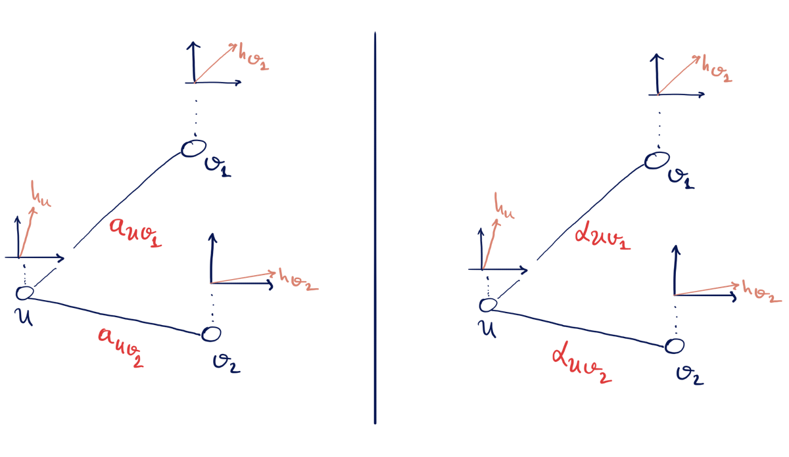
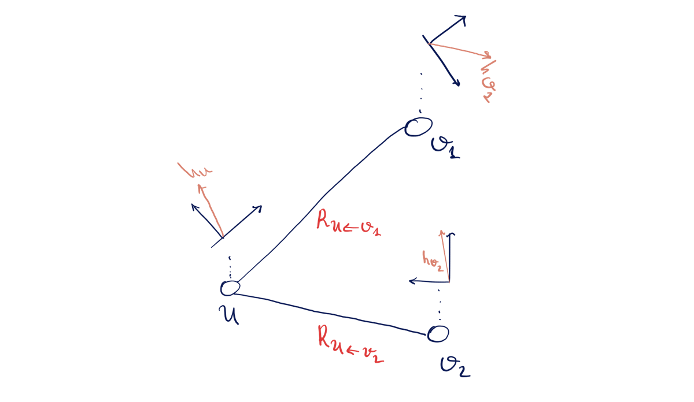
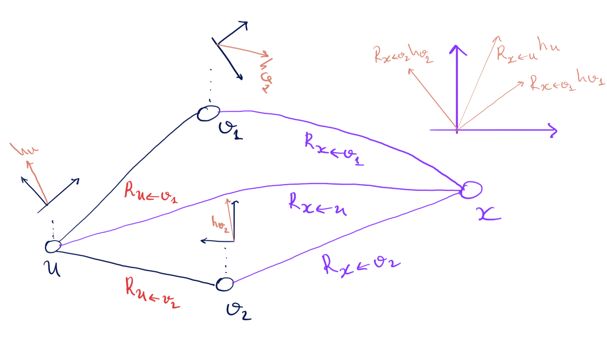

# Mathematical Overview of Bundle Neural Networks (BuNN)

> This is a companion maths note for the repository.  
> It explains how BuNN relates to familiar GNNs (GCN, GAT), and how the
> "vector bundle + connection + heat diffusion" story appears in the discrete implementation.

---

## 0. What this note is

- It **is** a bridge between:
  - standard message-passing GNNs (GCN / GAT),
  - the BuNN architecture used in the code, and
  - the geometric language (bundles, frames, connections, diffusion).

The structure:

1. Classic message passing: GCN and GAT.
2. From shared coordinates to node-wise frames (the bundle viewpoint).
3. Diffusion on graphs via the Laplacian, and connection to message passing
4. How a BuNN layer combines rotations + diffusion.

Extra maths (the geometric language):
The file continuous_maths.md adds the continuous picture that is classical in mathematics and which inspired this architecture for the interested reader. At the end of continuous_maths.md you will find a continuous <-> discrete dictionary of all terms used in this architecture.

---

## 1. Classic message passing: GCN and GAT

We'll use the following notation:

- Graph $G = (V, E)$ with nodes $u,v \in V$.
- $h_u^{(k)} \in \mathbb{R}^d$: feature vector of node $u$ at layer $k$.
- $N(u)$: neighbors of node $u$ (you can choose to include $u$ itself in $N(u)$; we'll assume it is included).

### 1.1 GCN layer

A (normalized) GCN layer can be written as:

$$
h_u^{(k+1)} 
  = \sigma\!\Big(
      W^{(k)} \sum_{v \in N(u)} a_{uv}\, h_v^{(k)}
    \Big),
$$

where:

- $W^{(k)} \in \mathbb{R}^{d_{\text{out}} \times d_{\text{in}}}$ is a trainable linear map (shared across all nodes and edges).
- $a_{uv}$ are **fixed scalar coefficients** that encode the local graph structure.

A common choice is

$$
a_{uv} =
  \begin{cases}
    \dfrac{1}{\sqrt{(\deg(u)+1)(\deg(v)+1)}}, 
      & \text{if } (u,v)\in E \text{ or } u=v,\\
    0, & \text{otherwise.}
  \end{cases}
$$

So in words: take neighbors' features $h_v^{(k)}$, scale them by fixed weights $a_{uv}$ derived from the graph, sum, apply a shared linear map $W^{(k)}$, then a nonlinearity $\sigma$.

Crucial observations:

1. **Same coordinate system at every node.**  
   A feature coordinate "means the same thing" at every node. This may seem like an abstract statement at this point but will become clear when we introduce node-wise frames below.

2. **No learned edge-wise geometry.**  
   All the information about the graph topology lives in the fixed scalar factors $a_{uv}$.

---

### 1.2 GAT layer

A Graph Attention Network (GAT) layer keeps the idea that **all nodes live in the same coordinate system**, but replaces the fixed coefficients $a_{uv}$ with learned attention weights $\alpha_{uv}^{(k)}$:

$$
h_u^{(k+1)} 
  = \sigma \Big(
      W^{(k)} \sum_{v \in N(u)} \alpha_{uv}^{(k)}\, h_v^{(k)}
    \Big).
$$

The weights $\alpha_{uv}^{(k)}$ are computed from features, e.g.:

$$
e_{uv}^{(k)}
  = \text{LeakyReLU}\Big(
       a^\top
       \big[W^{(k)} h_u^{(k)} || W^{(k)} h_v^{(k)}\big]
    \Big),
$$

$$
\alpha_{uv}^{(k)}
  = \frac{\exp(e_{uv}^{(k)})}{\sum_{w \in N(u)} \exp(e_{uw}^{(k)})}.
$$

So:

- GAT **learns** how important each neighbor is (via $\alpha_{uv}^{(k)}$),
- but still assumes all $h_v^{(k)}$ live in the **same** coordinate system, i.e. we just scale them by a learned constant before aggregating them.


Figure 1: GCN (left) and GAT (right) - we assume 2-dimensional feature vectors, $a_{uv_i}$ scalars that are fixed by the graph topology, while $\alpha_{uv_i}$ are scalars that we learn during training. Compare (particularly the axes of the vector space above each node) to Figure 2 below.

---

## 2. BuNN idea: local coordinates and the need for transport

GCN / GAT implicitly assume that feature coordinates have the same meaning everywhere. Inspired by the concept of vector bundles with connection from differential geometry (see continuous "cartoon" section below) the BuNN idea is to **drop the assumption that all nodes share the same coordinate system** and let each node have its own local coordiante system (local frame).

### 2.1 Very informal vector bundle language

The "vector bundle" viewpoint packages this as:

- To each node $u$ we attach a vector space (a **fiber**) $F_u \cong \mathbb{R}^d$ with its own **frame** (basis).
- A **section** is a choice of a vector in each fiber: $u \mapsto h_u \in F_u$.
- A **connection** tells you how to **transport** a vector from one fiber to another, i.e. how to change the basis when moving from one node to anohter.

On a graph, this becomes:

- One fiber $F_u$ per node $u$,
- For each edge $(u,v)$ a *transport* map

$$
  R_{u\leftarrow v} : F_v \rightarrow  F_u,
$$

  that lets you interpret a vector at $v$ as seen from $u$.

Then instead of aggregating raw $h_v$ for each node $v \in N(u)$, you aggregate:

$$
  \text{"message from } v \text{ to } u\text{"} 
    \sim R_{u\leftarrow v} h_v,
$$

and a BuNN-style message passing step looks schematically like

$$
  h_u^{(k+1)}
    \approx \sigma \Big(
      W^{(k)} 
      \sum_{v \in \mathcal{N}(u)}
        R_{u\leftarrow v} \, h_v^{(k)}
    \Big),
$$

where $R_{u\leftarrow v}$ are matrices which are learned during training.


Figure 2: In a BuNN we assume a different coordinate system at each node, and we learn how to change basis by learning the $R_{u\leftarrow v_i}$. In this case these are 2x2 matrices. Note that each edge has two matrices associated to it but $R_{v_i\leftarrow u} = R_{u\leftarrow v_i}^{-1}$ and we don't write it above.

---

### 2.2 Node-wise frames and transports $R_{u\leftarrow v} = O_u^\top O_v$

In BuNN the authors **do not** suggest we learn arbitrary edge-wise transports $R_{u\leftarrow v}$. Instead we should make a simplifying / structure-imposing choice:

- At each node $u$, we learn an **orthogonal matrix**
  
$$
  O_u \in \mathrm{SO}(d),
$$
  
  i.e. a $d \times d$ orthogonal matrix with determinant 1.

- The transport from $v$ to $u$ is then:

$$
  R_{u\leftarrow v}
    \;:=\; O_u^\top O_v \;\in\; \mathrm{SO}(d).
$$

Interpretation:

One way to picture the node-wise frames $\{O_u\}$ is via a **virtual reference node** $x$:

- Pretend there is an extra node $x$ connected to every node and we can use its local frame (basis) as a  **global reference frame** -- a basis in which we can compare feature vectors from all the nodes of the graph.
- Think of $O_u$ as a transport $R_{x\leftarrow u}$ that takes a vector in the local frame at $u$ to the global frame at $x$.

Then:

- A message from $v$ to $u$ can be decomposed as:

  1. $v \to x$: apply $R_{x\leftarrow v}$ (which is $O_{v}$),
  2. $x \to u$: apply $R_{u\leftarrow x}$ (which is $O_{u}^\top$ recall transpose = inverse).

- So the total transport is:

$$
  R_{u\leftarrow v}
    = R_{u\leftarrow x}R_{x\leftarrow v} 
    = O_u^\top O_v.
$$

This picture is handy to explain:

Figure 3: We add a "virtual node" x and use its frame in order to aggregate the feature vectors of each node in a common coordinate system.

This has two important consequences:

1. **Structure / flatness constraint.**  
   Because every $R_{u\leftarrow v}$ factors through a single set of node-wise frames $\{O_u\}$, the transports obey strong consistency constraints such as that going around a cycle multiplies to identity in the bundle frame: $v_k = v_0 \to v_{k-1} \to \dots \to v_0$, the product is (remember that the matrices are orthogonal so the transpose of a matrix is its inverse)
  
  $$
  O_{v_0}^\top O_{v_1} \cdot
  O_{v_1}^\top O_{v_2} \cdots
  O_{v_{k-1}}^\top O_{v_0}
  = I.
  $$
  
    This is a discrete analogue of a **flat connection**.

2. **Parameter sharing.**  
   We only need to learn $O_u$ for each node (through a shared neural network $\phi$), not a separate $R_{u\leftarrow v}$ for each edge.

---

### 2.3 Block-diagonal 2×2 rotations in practice

In the actual code you don't use full $d \times d$ matrices:

- The bundle dimension is $d = 2B$, for some number of **bundles** $B$.
- At each node $u$, the frame $O_u$ is a block-diagonal matrix with
  $B$ many $2 \times 2$ rotation blocks:

$$
  O_u = \mathrm{diag}\big(R(\theta_{u,1}), \dots, R(\theta_{u,B})\big),
$$
  
  where
  
$$
  R(\theta) =
    \begin{pmatrix}
      \cos\theta & -\sin\theta \\
      \sin\theta & \cos\theta
    \end{pmatrix}.
$$

- The angles $\theta_{u,b}$ are produced by a learned network
  $\phi$, which in the code is either:
  - a small **MLP**, or
  - a **GNN** on the graph (graphSAGE used in implementation).

So each node learns, taking into account local graph topology in the case when $\phi$ is a GNN, **how to rotate vectors in each fibre**, and these rotations are used to align neighbors.

---

## 3. Diffusion, Laplacians, and the bundle Laplacian

So far we focused on the **transport** part.  BuNN also uses **diffusion** via the graph Laplacian instead of the usual message passing in GCNs and GANs, which is the other half of the story. This allows a BuNN to propagate information to far-away nodes in one layer. Let's see how we can express a standard GCN layer update in terms of heat diffusion, which then allows us to see the diffusion in the BuNN as a generalisation.

### 3.1 From GCN message passing to diffusion

Let $G = (V,E)$ be a graph with

- adjacency matrix $A \in \mathbb{R}^{n \times n}$,
- degree matrix $D = \mathrm{diag}(d_1,\dots,d_n)$,
- random-walk matrix
  
$$
  P = D^{-1} A.
$$

The $(u,v)$ entry of $P$ is

$$
P_{uv} =
\begin{cases}
\frac{1}{d_u} & \text{if } (u,v)\in E,\\
0 & \text{otherwise,}
\end{cases}
$$

so each row of $P$ is a probability distribution over neighbours of $u$.

A **plain (linear) GCN layer** for node features $H^{(k)} \in \mathbb{R}^{n \times d_{\text{in}}}$ can be written (ignoring self-loops and normalisation tweaks for the moment) as

$$
H^{(k+1)} = \sigma\!\big( P H^{(k)} W^{(k)} \big),
$$

where

- $P$ aggregates neighbour information (row-stochastic "mixing"),
- $W^{(k)}$ is a shared weight matrix across all nodes,
- $\sigma$ is a nonlinearity.

If we momentarily **ignore** $W^{(k)}$ and $\sigma$, the core propagation step is

$$
H^{(k+1)} = P H^{(k)}.
$$

---

### 3.2 Random-walk Laplacian and one-step diffusion

Define the **random-walk Laplacian**

$$
L_{\mathrm{rw}} := I - P.
$$

The (discrete) **heat equation on a graph** with this Laplacian is

$$
\frac{\partial h(t)}{\partial t} = - L_{\mathrm{rw}}\, h(t),
$$

with solution

$$
h(t) = e^{-t L_{\mathrm{rw}}} h(0).
$$

If we take an **explicit Euler step** of size $\Delta t$ from time $t$ to $t+\Delta t$, we get

$$
h(t+\Delta t)
\approx h(t) - \Delta t \, L_{\mathrm{rw}} h(t)
= h(t) - \Delta t (I - P) h(t)
= \big( (1-\Delta t) I + \Delta t P \big) h(t).
$$

Now look at the special case $\Delta t = 1$. Then

$$
h(t+1) \approx P h(t).
$$

So:

> **A single GCN propagation step $H^{(k+1)} = P H^{(k)}$ is exactly the explicit-Euler update for one time unit of heat diffusion $\partial_t h = -L_{\mathrm{rw}} h$.**

When we add back the learnable channels and nonlinearity we're essentially doing:

1. **Channel mixing**: $H^{(k)} \mapsto H^{(k)} W^{(k)}$,
2. **One step of diffusion with $\Delta t = 1$**: $H^{(k)} W^{(k)} \mapsto P \big(H^{(k)} W^{(k)}\big)$,
3. **Nonlinearity**.

That's the "GCN as diffusion" picture with a *fixed* time step of $1$ per layer. But now we can view $t$ as a hyperparameter.

---

### 3.4 BuNN: from one-step diffusion to $e^{-tL}$

BuNN keeps the **same diffusion operator** $L_{\mathrm{rw}} = I - P$ (or a close variant), but:

1. First applies a **linear transform in bundle space**  
   
$$
   \hat{h}^{(k)}(0) = H^{(k)} W^{(k)},
$$
   
   (after synchronising frames), and then

2. Applies **continuous-time diffusion for an arbitrary time $t$**:
   
$$
   \hat{h}^{(k)}(t) = e^{-t L_{\mathrm{rw}}} \, \hat{h}^{(k)}(0).
$$

In code we can't form $e^{-tL_{\mathrm{rw}}}$ explicitly, so we approximate it with a **Taylor series** truncated after $K$ terms:

$$
e^{-t L_{\mathrm{rw}}}
\approx \sum_{j=0}^{K} \frac{(-t L_{\mathrm{rw}})^j}{j!},
$$

implemented by the iterative update in `sparse_heat_diffusion`.

A useful special case is **one-step truncation** $K = 1$:

$$
e^{-t L_{\mathrm{rw}}} \approx I - t L_{\mathrm{rw}}.
$$

For $t = 1$ this becomes

$$
e^{-L_{\mathrm{rw}}} \approx I - L_{\mathrm{rw}} = P,
$$

which recovers the GCN-style propagation.

So we can think of it like this:

- GCN corresponds to a **single explicit-Euler step** of diffusion per layer (equivalently, a Taylor approximation with $K=1$ and $t=1$).
- BuNN uses a **higher-order Taylor approximation** with tunable $t$ and $K$, giving an effectively multi-hop, smoothly time-controlled diffusion step per layer, done in the global frame of the vector bundle.

In other words:

> GCN ≈ one explicit Euler step" of diffusion per layer;  
> BuNN ≈ a more accurate $e^{-tL}$ diffusion step with learnable time scale $t$;

### 3.5 Scalar graph Laplacian and the heat equation

Let $L$ be the (normalised) graph Laplacian on $n$ nodes. For a scalar function $f : V \to \mathbb{R}$, the discrete heat equation is:

$$
\frac{d}{dt} f(t) = -L f(t), \qquad f(0) = f_0.
$$

This is the gradient flow of the Dirichlet energy. The solution is

$$
f(t) = e^{-tL} f_0,
$$

where $e^{-tL}$ is the **heat kernel** on the graph. Intuitively, it smooths/averages the signal over neighbours as $t$ increases.

### 3.6 Vector-valued diffusion on a trivial bundle

Now let each node carry a feature vector $h_u(t) \in \mathbb{R}^d$. Stack them into a matrix

$$
H(t) \in \mathbb{R}^{n \times d},
$$

where the $u$-th row is $h_u(t)^\top$. If we diffuse each coordinate independently, then

$$
H(t) = e^{-tL} H(0).
$$

Equivalently, if we vectorise:

- Let $\mathrm{vec}(H) \in \mathbb{R}^{nd}$ be the vector obtained by stacking rows of $H$.

Then

$$
\mathrm{vec}(H(t))
  = (e^{-tL} \otimes I_d) \, \mathrm{vec}(H(0)),
$$

where $\otimes$ is the Kronecker product and $I_d$ is the $d\times d$ identity. The operator

$$
e^{-tL} \otimes I_d
$$

is the **trivial-bundle heat operator**: same diffusion pattern for every feature dimension.

In the code, instead of materialising $e^{-tL}$ explicitly, we approximate it via a truncated **Taylor series**:

$$
e^{-tL}
  \approx \sum_{k=0}^K \frac{(-tL)^k}{k!},
$$

and apply $L$ using sparse matrix–vector products. This is implemented in the
method `sparse_heat_diffusion`. Alternatively, for large $t$, the authors point out that spectral methods should be used.

### 3.7 Bundle Laplacian (discrete connection Laplacian)

With node-wise frames $O_u$, we want to diffuse **sections of the bundle**, i.e. feature vectors expressed in their local frames.

Let $h_u \in \mathbb{R}^d$ be the local coordinates at node $u$. Introduce "global" coordinates

$$
\tilde h_u = O_u h_u.
$$

Now stack them into a big vector $\tilde h \in \mathbb{R}^{nd}$, and similarly for $h$. Let

$$
O = \textrm{diag}(O_1,\dots,O_n) \in \mathbb{R}^{nd \times nd}
$$

be the block-diagonal matrix of all frames, so that

$$
\tilde h = O h.
$$

We diffuse **in the global frame** using the trivial-bundle heat operator:

$$
\tilde h(t)
  = (e^{-tL} \otimes I_d)\, \tilde h(0).
$$

Then we return to local coordinates:

$$
h(t)
  = O^\top \tilde h(t)
  = O^\top (e^{-tL} \otimes I_d) O\, h(0).
$$

This defines the **bundle heat operator**

$$
e^{-t\Delta_B}
  := O^\top (e^{-tL} \otimes I_d) O.
$$

The corresponding **bundle Laplacian** (discrete connection Laplacian) is

$$
\Delta_B
  = O^\top (L \otimes I_d) O.
$$

In a more classical neighbour-sum form, for appropriate scalar weights $w_{uv}$ derived from $L$, we can write

$$
(\Delta_B h)_u
  = \sum_{v \sim u} w_{uv} \,\bigl(h_u - R_{u\leftarrow v} h_v\bigr),
  \qquad
  R_{u\leftarrow v} = O_u^\top O_v.
$$

The bundle Laplacian is the discrete analogue of the "connection Laplacian" $\textrm{tr}\nabla^2$ on a vector bundle with flat connection. It generalizes the Laplace operator from functions to sections of vector bundles (more precisely the Laplace-Beltrami operator since the latter is defined for manifolds).

---

## 4. One BuNN layer: maths ↔ code

A single BuNN layer in this repo is implementing, in a discrete and
parameterised way, the idea:

> "Express feature vectors in the global frame (transport to the virtual node x) → apply a linear map → diffuse with a graph Laplacian → transport back to local frames→ residual + nonlinearity."

Here is the step-by-step mapping.

### 4.1 Input embedding

Raw node features $x_u \in \mathbb{R}^{d_{\text{in}}}$ are mapped into
bundle space of dimension $d = 2B$:

$$
h_u^{(0)} = W_{\text{in}} x_u.
$$

In the code:

- `self.input_embed = nn.Linear(in_dim, self.total_dim)`
- `h = self.input_embed(x)`

where `self.total_dim = 2 * num_bundles`.

### 4.2 Learn node-wise frames via φ-network

For each layer $k$, a φ-network outputs per-node angles $\phi_{u,b}^{(k)}$ (for bundles $b = 1,\dots,B$), from which we build $O_u^{(k)} \in SO(2B)$.

- In small graphs, φ is an MLP on the bundle features.
- In Minesweeper, φ is a GraphSAGE-like GNN that sees the graph structure.

In code this looks like (schematically):

- `angles = self.phi_networks[layer_idx](h)`  (MLP φ)
- or `angles = self.phi_networks[layer_idx](h, edge_index)` (GNN φ)

and `self.apply_rotations` converts these angles into the corresponding block-diagonal rotations $O_u^{(k)}$.

### 4.3 Rotate into global frame

Given local features $h_u^{(k)}$ and frames $O_u^{(k)}$, we form

$$
\tilde h_u^{(k)} = O_u^{(k)} h_u^{(k)}.
$$

In code:

- `h_global = self.apply_rotations(h, angles, transpose=False)`

Here `transpose=False` corresponds to multiplying by $O_u^{(k)}$ rather than its transpose.

### 4.4 Linear transform in bundle space

We apply a shared linear map $W^{(k)}$ in this global frame:

$$
\hat h_u^{(k)} = W^{(k)} \tilde h_u^{(k)}.
$$

In code:

- `h_transformed = self.transforms[layer_idx](h_global)`

Each `self.transforms[layer_idx]` is an `nn.Linear(self.total_dim, self.total_dim)`.

### 4.5 Scalar heat diffusion

We want to diffuse the features with the heat operator

$$
\hat h^{(k)}(t) \approx e^{-tL}\,\hat h^{(k)}(0),
$$

and we approximate this by truncating the Taylor series of $e^{-tL}$:

$$
e^{-tL}\,\hat h^{(k)}(0)
\;\approx\;
\sum_{j=0}^K \frac{(-tL)^j}{j!}\,\hat h^{(k)}(0).
$$

Instead of forming powers of $L$, we use a simple recurrence.  
Define

$$
\text{term}_0 := \hat h^{(k)}(0), \qquad
\text{term}_j := \frac{-t}{j}\,L\,\text{term}_{j-1} \quad (j \ge 1).
$$

Then by induction,

$$
\text{term}_j = \frac{(-tL)^j}{j!}\,\hat h^{(k)}(0),
$$

so the truncated sum is just

$$
\hat h^{(k)}(t) \approx \sum_{j=0}^K \text{term}_j.
$$

In code this becomes:
```python
result = h.clone()  # term_0
term   = h.clone()

for j in range(1, K + 1):
    term   = (-t / j) * sparse_laplacian_mult(term)  # term_j
    result = result + term                           # accumulate Σ term_j
```

Here `sparse_laplacian_mult` applies $L$ in sparse form, and `result` is the approximation to $e^{-tL}\,\hat h^{(k)}(0)$.

### 4.6 Rotate back to local frames

Unless we are in the `no_rotate_back` ablation, we rotate with $(O_u^{(k)})^\top$:

$$
h_u^{\text{out},(k)}
  = (O_u^{(k)})^\top \hat h_u^{(k)}(t).
$$

This gives, at the level of the entire graph, the action of the bundle heat operator

$$
e^{-t\Delta_B}
  = O^\top (e^{-tL} \otimes I_d) O.
$$

In code:

- If `rotation_mode == "no_rotate_back"`, then:

  - `h_out = h_diffused`

- Otherwise:

  - `h_out = self.apply_rotations(h_diffused, angles, transpose=True)`

where `transpose=True` corresponds to multiplying by $(O_u^{(k)})^\top$.

### 4.7 Residual connection and nonlinearity

Finally we add a residual connection and apply a nonlinearity (GELU) and
dropout:

$$
h_u^{(k+1)}
  = h_u^{(k)} + \sigma\big(h_u^{\text{out},(k)}\big).
$$

In code:

- `h = h + F.gelu(self.dropout(h_out))`

This completes one BuNN layer. Stacking multiple such layers with different φ-networks and linear transforms gives the full architecture.

---